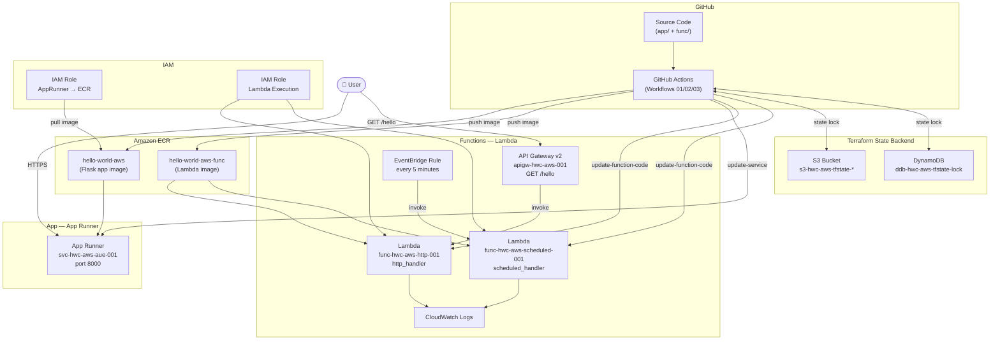

# Hello World Container — AWS Version

## Overview

AWS equivalent of the Azure Hello World Container project. The same Flask app is containerised and deployed to **AWS App Runner** via **Amazon ECR**, with infrastructure managed by Terraform and CI/CD through **GitHub Actions**. The project also includes **AWS Lambda functions** — the equivalent of the Azure Function App — triggered via **API Gateway** (HTTP) and **EventBridge** (scheduled).

Key optimisations over the Azure version:
- **App Runner** scales to zero when idle (no always-on cost like App Service B1)
- **ECR scan-on-push** replaces the manual Trivy install step
- **OIDC authentication** replaces long-lived service principal secrets
- **GitHub Actions** replaces Azure DevOps Pipelines
- **`aws lambda wait function-updated`** replaces the manual polling loop used for App Runner

---

## Architecture



---

## Project Structure

```
hello-world-container-aws/
├── .github/
│   └── workflows/
│       ├── 01-create-infra.yml
│       ├── 02-build-deploy.yml
│       └── 03-destroy-infra.yml
├── app/
│   ├── app.py
│   ├── requirements.txt
│   └── tests/
│       ├── conftest.py
│       └── test_app.py
├── func/
│   ├── handler.py          # http_handler + scheduled_handler
│   ├── requirements.txt
│   └── tests/
│       ├── conftest.py
│       └── test_handler.py
├── infra/
│   ├── providers.tf        # AWS provider + S3 remote state backend
│   ├── variables.tf
│   ├── main.tf             # ECR, IAM roles, App Runner, Lambda, API GW, EventBridge
│   └── outputs.tf
├── Dockerfile              # Flask app (App Runner)
├── Dockerfile.func         # Lambda functions
└── README.md
```

---

## AWS Resources

### App (App Runner)

| Resource | Name |
|----------|------|
| ECR Repository | `hello-world-aws` |
| App Runner Service | `svc-hwc-aws-aue-001` |
| IAM Role (App Runner → ECR) | `role-hwc-aws-apprunner-ecr` |

### Functions (Lambda)

| Resource | Name |
|----------|------|
| ECR Repository (func) | `hello-world-aws-func` |
| Lambda — HTTP trigger | `func-hwc-aws-http-001` |
| Lambda — Scheduled trigger | `func-hwc-aws-scheduled-001` |
| IAM Role (Lambda execution) | `role-hwc-aws-lambda-exec` |
| API Gateway v2 | `apigw-hwc-aws-001` |
| EventBridge Rule | `rule-hwc-aws-scheduled-001` (every 5 minutes) |

### Terraform State Backend (never destroyed)

| Resource | Name |
|----------|------|
| S3 Bucket | `s3-hwc-aws-tfstate-<ACCOUNT_ID>` |
| DynamoDB Lock Table | `ddb-hwc-aws-tfstate-lock` |
| State Key | `hwc-aws.terraform.tfstate` |

> The S3 bucket name includes the AWS account ID for global uniqueness. Both the bucket and DynamoDB table are created by the Bootstrap job in Workflow 01 and are never touched by Workflow 03.

---

## Infrastructure (Terraform)

- **Terraform version:** >= 1.7.0
- **AWS provider:** ~> 5.0
- **Backend:** S3 + DynamoDB (remote state with locking)
- **Region:** `ap-southeast-2` (Sydney)

---

## Prerequisites — OIDC Setup (one-time, done in AWS Console)

GitHub Actions authenticates to AWS via OIDC — no long-lived access keys needed.

**1. Create the OIDC provider in IAM:**
- Provider URL: `https://token.actions.githubusercontent.com`
- Audience: `sts.amazonaws.com`

**2. Create an IAM role with this trust policy:**
```json
{
  "Version": "2012-10-17",
  "Statement": [{
    "Effect": "Allow",
    "Principal": {
      "Federated": "arn:aws:iam::<ACCOUNT_ID>:oidc-provider/token.actions.githubusercontent.com"
    },
    "Action": "sts:AssumeRoleWithWebIdentity",
    "Condition": {
      "StringEquals": {
        "token.actions.githubusercontent.com:aud": "sts.amazonaws.com"
      },
      "StringLike": {
        "token.actions.githubusercontent.com:sub": "repo:<YOUR_GITHUB_ORG>/<YOUR_REPO>:*"
      }
    }
  }]
}
```

**3. Attach permissions to the role** (AdministratorAccess for the POC, scope down for production).

**4. Add the role ARN as a GitHub Actions variable:**
- Go to: GitHub repo → Settings → Secrets and variables → Actions → Variables
- Add: `AWS_ROLE_ARN` = `arn:aws:iam::<ACCOUNT_ID>:role/<ROLE_NAME>`

---

## GitHub Environments

| Environment | Approval |
|-------------|----------|
| `prod` | Manual approval required |

Set up at: GitHub repo → Settings → Environments → New environment → `prod` → add required reviewers.

---

## Workflows

### Workflow 01 — Create Infrastructure (`01-create-infra.yml`)

Trigger: **manual only** (workflow_dispatch)

**Jobs:**

1. **Bootstrap** — creates the S3 bucket (versioned, AES256 encrypted) and DynamoDB lock table; idempotent and safe to re-run if they already exist.

2. **Terraform Apply** (requires `prod` approval):
   - Targeted apply — creates both ECR repos and both IAM roles first
   - Pushes a minimal seed image (`python -m http.server 8000`) to the app ECR so App Runner has a valid image during creation
   - Pushes a minimal seed Lambda image (based on `public.ecr.aws/lambda/python:3.11`) to the func ECR so Lambda functions can be created by Terraform
   - Full apply — creates App Runner, Lambda functions, API Gateway, and EventBridge rule

> **Why seed images?** App Runner health-checks the container on creation (`CREATE_FAILED` if no process is listening). Lambda also requires a valid image URI at creation time. Both seed images are replaced by the real application images when Workflow 02 runs.

> **Why no plan file?** The targeted apply increments the Terraform state serial number, making any previously saved plan stale. A direct `terraform apply -auto-approve` is used instead.

---

### Workflow 02 — Build & Deploy (`02-build-deploy.yml`)

Triggers:
- **Auto** on push to `main` for changes to `app/**`, `Dockerfile`, `func/**`, or `Dockerfile.func`
- **Manual** via workflow_dispatch

The app and func pipelines run in parallel — each has its own quality gate → build → deploy chain.

**App jobs (App Runner):**

| Job | Details |
|-----|---------|
| Flake8 Lint | Max line length 120, excludes `app/tests` |
| Bandit Security Scan | Recursive, low-level severity (`-ll`), excludes `app/tests` |
| Pytest + Coverage | Min **80% coverage** required; uploads `coverage.xml` artifact |
| Build and Push to ECR | Builds `Dockerfile`; tagged with run number + `latest`; ECR scan-on-push triggers automatically |
| Deploy to App Runner | Updates service with new image tag; polls status every 10s (up to 10 min) until `RUNNING`; requires `prod` approval |

**Func jobs (Lambda):**

| Job | Details |
|-----|---------|
| Flake8 Lint (func) | Max line length 120, excludes `func/tests` |
| Bandit Security Scan (func) | Recursive, low-level severity (`-ll`), excludes `func/tests` |
| Pytest + Coverage (func) | Min **80% coverage** required; uploads `coverage-func.xml` artifact |
| Build and Push Lambda Image | Builds `Dockerfile.func`; tagged with run number + `latest`; pushed to `hello-world-aws-func` ECR repo |
| Deploy Lambda Functions | Updates both Lambda functions via `update-function-code`; uses `aws lambda wait function-updated` for clean completion; requires `prod` approval |

> **Note:** `aws apprunner` has no `wait` subcommand — App Runner deployment polls via `describe-service`. Lambda uses the native `aws lambda wait` command.

---

### Workflow 03 — Destroy Infrastructure (`03-destroy-infra.yml`)

Trigger: **manual only** (workflow_dispatch), requires `prod` approval

**Steps:**
1. Empties the app ECR repository (`hello-world-aws`) via `batch-delete-image`
2. Empties the func ECR repository (`hello-world-aws-func`) via `batch-delete-image`
3. Runs `terraform destroy -auto-approve`

> Terraform cannot delete non-empty ECR repositories, so both must be drained first.

The S3 state bucket and DynamoDB lock table are **not** touched.

---

## Reproducing from Scratch

1. Create a GitHub repo and push this folder as the repo root
2. Complete the OIDC setup (one-time, see above)
3. Create the `prod` GitHub Environment with required reviewers
4. Add the `AWS_ROLE_ARN` Actions variable
5. Run **Workflow 01** (Actions → 01 - Create Infrastructure → Run workflow) — approve the `prod` gate
6. Run **Workflow 02** (push a change to `app/` or trigger manually) — approve the deploy gate
7. To tear down: run **Workflow 03** — state backend remains intact for next deployment

---

## Application

### Flask App (App Runner)

| Endpoint | Response |
|----------|----------|
| `GET /` | `Hello, World!` |
| `GET /health` | `{"status": "healthy"}` (HTTP 200) |

Served by **Gunicorn** on port 8000 (`python:3.11-slim` base image).

The App Runner URL is printed at the end of Workflow 02's deploy job and is also available as the `app_runner_service_url` Terraform output.

### Lambda Functions

| Function | Trigger | Handler | Response |
|----------|---------|---------|----------|
| `func-hwc-aws-http-001` | API Gateway `GET /hello` | `handler.http_handler` | `{"message": "Hello from Lambda!", "source": "http-trigger"}` |
| `func-hwc-aws-scheduled-001` | EventBridge every 5 minutes | `handler.scheduled_handler` | Logs invocation; returns `{"status": "ok"}` |

Both functions share the same container image (`hello-world-aws-func`) — `image_config.command` in Terraform sets the handler entry point per function.

The API Gateway URL is printed at the end of Workflow 02's `deploy-func` job and is also available as the `api_gateway_url` Terraform output.

---

## Azure vs AWS Comparison

| Concern | Azure Version | AWS Version |
|---------|--------------|-------------|
| Container Registry | ACR | ECR |
| Image scanning | Trivy (manual install) | ECR scan-on-push (built-in) |
| App hosting | App Service B1 (always on) | App Runner (scales to zero) |
| Serverless functions | Azure Function App | AWS Lambda |
| Function HTTP trigger | HTTP Function + Function App endpoint | Lambda + API Gateway v2 |
| Function timer trigger | Timer Function (`TimerTrigger`) | Lambda + EventBridge (`rate(5 minutes)`) |
| Function container image | `Dockerfile.func` → ACR | `Dockerfile.func` → ECR (`hello-world-aws-func`) |
| Function deployment | `az functionapp` update | `aws lambda update-function-code` + `wait function-updated` |
| IaC state | Azure Storage | S3 + DynamoDB |
| CI/CD | Azure DevOps Pipelines | GitHub Actions |
| Auth (pipelines → cloud) | Service principal secrets | OIDC (no long-lived secrets) |
| Approval gates | ADO Environments | GitHub Environments |
